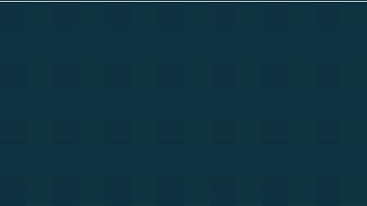
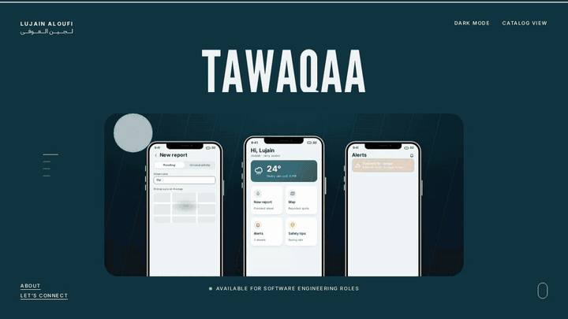
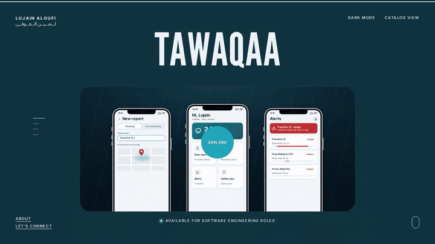
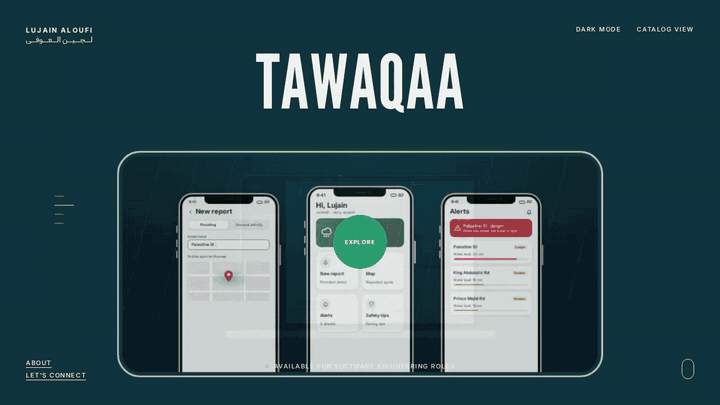
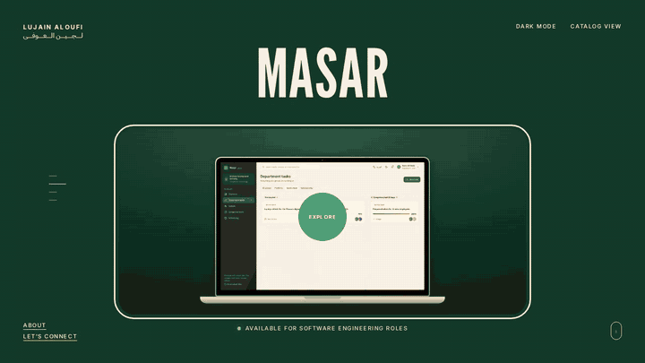
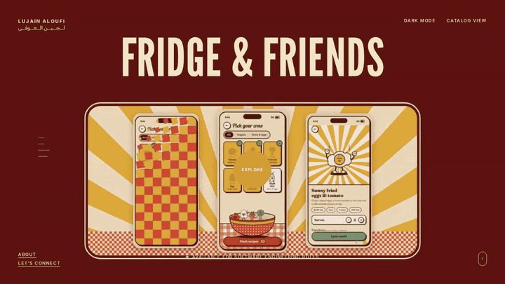
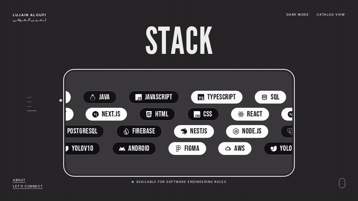
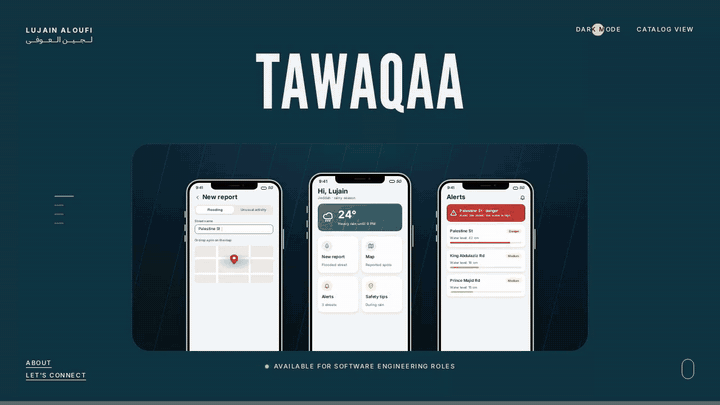

# Lujain Aloufi · Portfolio

Software engineer in Jeddah building full-stack systems, from flood alerts for Jeddah's rainy season to workspaces for government teams.

This repository is my personal portfolio site: a full-screen deck with one card per project, a project page for each one, a page for my stack, and an About page. Everything is plain HTML, CSS and JavaScript with no framework, and it is assembled by a small Python build script.

- **Email:** [lujain.aloufi0@gmail.com](mailto:lujain.aloufi0@gmail.com)
- **LinkedIn:** [linkedin.com/in/lujain-aloufi](https://www.linkedin.com/in/lujain-aloufi/)

---

## Intro



The page opens with the first project card small, faint and tilted back. It lies flat, then grows toward you and sinks to the bottom edge while the other projects fan up behind it. The stack folds back into it, the card rises into the middle still dimmed, drops into place, and brightens as the title comes in.

- The motion follows curves I measured frame by frame from a screen recording, sampled at 60 Hz (`src/intro_curves.py`).
- Each card gets one continuous Web Animations timeline that moves only `transform` and `opacity`, so the browser's compositor can play it smoothly even while the page is still loading media.
- The intro waits for the fonts (or 1.2 s at most) before it starts, and the content inside the cards stays still until the card brightens.

## Projects deck



Scrolling, swiping or the arrow keys move between projects. The current card drops, grows and fades out in front while the next one settles in. The title above changes as one block, and the page colour switches to that project's colour.

- A dot cursor follows the mouse and grows into **EXPLORE** only over the card.
- The short lines on the left show which project you are on and jump straight to any of them.
- A status line under the card reads "Available for software engineering roles".

## Tawaqaa



**Graduation project · IoT & ML · University of Jeddah, 2024 · Grand Special Award, SGiE 2024**

Tawaqaa is a smart road-safety system for Jeddah's rainy season. Citizens report flooded streets from an Android app by street name or map pin. Reports are counted and ranked per street, a water-level sensor measures the hotspot, and a YOLOv10 model trained on 1,532 flooded-car and 171 people-in-flood images flags danger in real time. Drivers get alerts and a safer route, and authorities review and close reports on a live Firebase-synced web console.

Opening a card lifts it, grows it to fill the screen and slides the project page in. Every Tawaqaa screen on the page is drawn in code (HTML and CSS inside an iPhone and a MacBook frame) and animated:

1. **Report:** a flooded street is reported by name or by dropping a pin, then confirmed.
2. **Alerts:** streets are ranked by repeated reports and measured water height, next to a live water sensor.
3. **Reroute:** the map marks the flooded street and draws a safer route around it.
4. **Detect:** YOLOv10 spots flooded cars and people in the water on live camera frames.
5. **Respond:** authorities review ranked reports live and delete the ones that are resolved.

**Stack:** Java, Android, Firebase, Python, YOLOv10, JavaScript, Figma

## Masar



**Bilingual web app for government teams · Full-stack engineer · 2026**

Masar is a task workspace for government departments. Every task has an owner, every step is visible, and finished work stays on record. Members, department heads, HR and administrators each get their own view, with progress by group and average days to complete. It has full Arabic and English with right-to-left layout, Hijri and Gregorian dates, dark mode and live updates.

The page plays recorded screens of the app inside a MacBook: sign-in, the department overview, the task board, completing a task, groups, and switching to Arabic and dark mode.

**Stack:** TypeScript, React, Next.js, NestJS, Node.js, PostgreSQL

## Fridge & Friends



**iOS app concept · UI, characters & motion · 2026**

Fridge & Friends helps you cook with what's already in your fridge. Your ingredients jump into the bowl and a crew of twelve rubber-hose characters tells you what you can make. Every screen change is a checkerboard wipe, and every character reacts to what you do.

The page walks through the flow: opening the fridge, tossing ingredients into the bowl, the recipe reveal, cooking along with timers, and the celebration at the end.

**Stack:** Figma, HTML, CSS, JavaScript

## Stack



The last card is my toolset. On the home screen, rows of tool chips drift in alternating directions and fade between white and black. The Stack page groups the 17 tools I use (languages, frameworks, data & cloud, and AI, mobile & design), each with its logo and the projects I used it in. The filters show only the tools behind one project.

## Catalog view and dark mode



**Catalog view** swaps the deck for a list of project names. **Dark mode** deepens every project colour, and the choice is remembered.

## About



The About page covers what I work on, the tools I use, recognition, and a contact form. The form sends messages to my email through FormSubmit, and opens the visitor's email app with the message ready if sending fails. The footer has navigation, LinkedIn, my email, a live Jeddah clock and my name set full width.

---

## How it's built

```
index.html              the built site (open it directly or host it as a static page)
assets/                 recorded app screens, as animated WebP
src/
  build.py              assembles index.html from the pieces below
  base.html             page shell: <head>, About page, mobile menu, shared scripts
  styles.css            home deck, transitions, intro, cursor, project and stack pages, footer
  tawaqaa.css           code-drawn iPhone and MacBook frames and the Tawaqaa screens
  tawaqaa_scenes.py     markup for the Tawaqaa screens
  main.js               deck navigation, intro, cursor, project pages, logo fitting
  intro_curves.py       intro motion curves, sampled at 60 Hz
  icons.json            tool logos as SVG paths
docs/gifs/              the recordings in this README
```

### Build

```bash
pip install numpy scipy
python3 src/build.py            # writes index.html
python3 src/build.py --single   # also writes dist/portfolio.html with all media inlined
```

### Run locally

Open `index.html` in a browser, or serve the folder:

```bash
python3 -m http.server 8000
```

### Highlights

- **No framework:** semantic HTML, modern CSS (container queries, `text-wrap: balance`) and vanilla JavaScript.
- **Motion:** card changes use CSS keyframes, opening a project uses a shared-element grow, and the intro uses measured Web Animations curves. Everything moves only `transform` and `opacity`.
- **Code-drawn mockups:** the Tawaqaa phones and laptop are HTML and CSS sized with container units, so they stay sharp at any size.
- **Bilingual name:** the Arabic name under the English one is stretched with kashida (ـ) at the joining letters until it is exactly the same width, at the same type size.
- **Accessibility:** keyboard navigation for the deck and project pages, visible focus states, labelled controls, and contrast-checked text and mockup colours.
- **Performance:** media is lazy-loaded animated WebP, and the hosted page is about 345 KB of HTML before media.

## Design inspiration

The layout and motion are inspired by [johngearhart.me](https://johngearhart.me/).

© 2026 Lujain Aloufi
