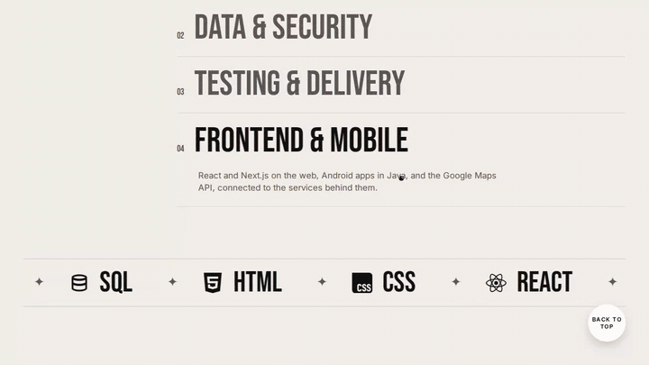
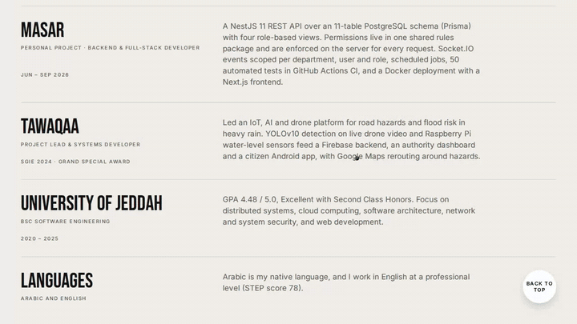

# Lujain Aloufi · Portfolio

Software engineer in Jeddah. I've built flood alerts for the city's rainy season and a task workspace for government teams.

This repository is my personal portfolio site: a full-screen deck with one card per project, a project page for each one, a page for my stack, and an About page. Everything is plain HTML, CSS and JavaScript with no framework, and it is assembled by a small Python build script.

- **Email:** [lujain.aloufi0@gmail.com](mailto:lujain.aloufi0@gmail.com)
- **LinkedIn:** [linkedin.com/in/lujain-aloufi](https://www.linkedin.com/in/lujain-aloufi/)

Want to use this design for your own portfolio? See [Make it yours](#make-it-yours).

---

## Intro


The page opens with the first project card small, faint and tilted back. It lies flat, then grows toward you and sinks to the bottom edge while the other projects fan up behind it. The stack folds back into it, the card rises into the middle still dimmed, drops into place, and brightens as the title comes in.

- The motion follows curves I measured frame by frame from a screen recording, sampled at 60 Hz (`src/intro_curves.py`).
- Each card gets one continuous Web Animations timeline that moves only `transform` and `opacity`, so the browser's compositor can play it smoothly even while the page is still loading media.
- The intro waits for the fonts (or 1.2 s at most) before it starts, and the content inside the cards stays still until the card brightens.

## Projects deck


Scrolling, swiping or the arrow keys move between projects. The current card drops, grows and fades out in front while the next one settles in. The title above changes as one block, and the page colour switches to that project's colour.

- A dot cursor follows the mouse and grows into **EXPLORE** only over the card.
- The short lines on the left show which project you are on and jump straight to any of them.
- A status line under the card reads "Available for software engineering roles".

## Tawaqaa


**Graduation project · IoT & ML · Project lead & systems developer · Grand Special Award, SGiE 2024**

Tawaqaa is a road-safety system for Jeddah's rainy season. Citizens report flooded streets from an Android app, by street name or with a pin on the map. Reports are counted and ranked by street, a water-level sensor measures the worst spot, and a YOLOv10 model trained on 1,532 images of flooded cars and 171 of people in floodwater flags danger in real time. Drivers get an alert and a safer route, while authorities review and close reports on a web console that syncs live with Firebase.

Opening a card lifts it, grows it to fill the screen and slides the project page in. Every Tawaqaa screen on the page is drawn in code (HTML and CSS inside an iPhone and a MacBook frame) and animated:

1. **Report:** a flooded street is reported by name or by dropping a pin, then confirmed.
2. **Alerts:** streets are ranked by repeated reports and measured water height, next to a live water sensor.
3. **Reroute:** the map marks the flooded street and draws a safer route around it.
4. **Detect:** YOLOv10 spots flooded cars and people in the water on live camera frames.
5. **Respond:** authorities review ranked reports live and delete the ones that are resolved.

**Stack:** Java, Android, Firebase, Python, YOLOv10, JavaScript, Figma

## Masar


**Bilingual web app for government teams · Backend & full-stack developer · Jun – Sep 2026**

Masar is a task workspace for government departments. Each task has an owner and steps the whole team can see, and finished work stays on record. Members, department heads, HR and administrators each get their own view, showing progress by group and the average days to finish a task. The app works fully in Arabic and English, with right-to-left layout, Hijri and Gregorian dates, dark mode and live updates.

The page plays recorded screens of the app inside a MacBook: sign-in, the department overview, the task board, completing a task, groups, and switching to Arabic and dark mode.

**Stack:** TypeScript, React, Next.js, NestJS, Node.js, PostgreSQL

## Fridge & Friends


**iOS app concept · UI, characters & motion · 2026**

Fridge & Friends helps you cook with what's already in your fridge. Your ingredients jump into a bowl, and a crew of twelve rubber-hose characters tells you what you can make. Screens change with a checkerboard wipe, and the characters react to what you do.

The page walks through the flow: opening the fridge, tossing ingredients into the bowl, the recipe reveal, cooking along with timers, and the celebration at the end.

**Stack:** Figma, HTML, CSS, JavaScript

## Stack


The last card is my toolset. On the home screen, rows of tool chips drift in alternating directions and fade between white and black. The Stack page groups the 16 tools I use (languages, frameworks, data, and AI, mobile & design), each with its logo and the projects I used it in. The filters show only the tools behind one project.

## Catalog view and dark mode


**Catalog view** swaps the deck for a list of project names. **Dark mode** deepens every project colour, and the choice is remembered.

## About


The About page opens with a short intro: I'm a backend-focused software engineer who builds REST APIs, relational data models and real-time services and takes them through to deployment. Below it, four expertise areas open one at a time:

- **Backend & APIs:** Node.js, NestJS and TypeScript, server-enforced role-based access, WebSockets (Socket.IO) and scheduled jobs.
- **Data & security:** PostgreSQL with Prisma, Firebase, argon2 password hashing, httpOnly JWT sessions with revocation, one-time activation codes and rate limiting.
- **Testing & delivery:** Vitest and Playwright, GitHub Actions CI, Docker and cloud deployment.
- **Frontend & mobile:** React, Next.js, Android (Java) and the Google Maps API.

A strip of tool logos scrolls underneath.

## Awards, experience and education



- **Awards:** photos of the Grand Special Award trophy and certificate, the Gold Medal certificate, and the Tawaqaa poster on show at the Saudi Global Inventions and Innovations Expo (SGiE 2024). Under them is my degree: BSc Software Engineering, GPA 4.48 / 5.0, Second Class Honors.
- **Jeddah Municipality, Digital Transformation Department (Jan – Mar 2025):** software engineering trainee. I built three pages for the internal Innovation Portal, worked through requirements with stakeholders, tested features in review cycles and prototyped a unified municipality app concept.
- **Masar (Jun – Sep 2026):** a NestJS 11 REST API over an 11-table PostgreSQL schema with four role-based views, server-enforced permissions, Socket.IO events, scheduled jobs and 50 automated tests in CI.
- **Tawaqaa:** I was project lead and systems developer on an IoT, AI and drone platform for road hazards and flood risk.
- **University of Jeddah (2020 – 2025)** and my languages: Arabic (native) and English (professional, STEP 78).

## Contact and footer



The contact form sends messages to my email through FormSubmit, and opens the visitor's email app with the message ready if sending fails. Next to it are my email, with a copy button, and LinkedIn. The footer has navigation, a live Jeddah clock and my name set full width.

## How it's built

```
index.html              the built site (open it directly or host it as a static page)
assets/                 recorded app screens, as animated WebP
src/
  build.py              assembles index.html from the pieces below
  base.html             page shell: <head>, About page, mobile menu, shared scripts
  styles.css            home deck, transitions, intro, cursor, project and stack pages, footer
  tawaqaa.css           code-drawn iPhone and MacBook frames and the Tawaqaa screens
  tawaqaa_scenes.py     markup for the Tawaqaa screens
  main.js               deck navigation, intro, cursor, project pages, logo fitting
  intro_curves.py       intro motion curves, sampled at 60 Hz
  icons.json            tool logos as SVG paths
docs/gifs/              the recordings in this README
assets/award-*.webp     award and expo photos (cleaned up and upscaled 2x)
```

### Build

```bash
pip install numpy scipy
python3 src/build.py            # writes index.html
python3 src/build.py --single   # also writes dist/portfolio.html with all media inlined
```

### Run locally

Open `index.html` in a browser, or serve the folder:

```bash
python3 -m http.server 8000
```

### Highlights

- **No framework:** semantic HTML, modern CSS (container queries, `text-wrap: balance`) and vanilla JavaScript.
- **Motion:** card changes use CSS keyframes, opening a project uses a shared-element grow, and the intro uses measured Web Animations curves. Everything moves only `transform` and `opacity`.
- **Code-drawn mockups:** the Tawaqaa phones and laptop are HTML and CSS sized with container units, so they stay sharp at any size.
- **Bilingual name:** the Arabic name under the English one is stretched with kashida (ـ) at the joining letters until it is exactly the same width, at the same type size.
- **Accessibility:** keyboard navigation for the deck and project pages, visible focus states, labelled controls, and contrast-checked text and mockup colours.
- **Performance:** media is lazy-loaded animated WebP, and the hosted page is about 345 KB of HTML before media.

## Make it yours

Want to use this design for your own portfolio? You're welcome to. Fork the repository, swap in your details using the steps below, and publish it.

> **Please replace all of my content.** The projects, descriptions, photos, app recordings and About page text are about me and my work. Keep the code and the design, but put your own projects, photos and story in their place.

### 1. Get a copy

1. Click **Fork** at the top of this page (or **Use this template** if it's shown).
2. Clone your copy:
   ```bash
   git clone https://github.com/YOUR-USERNAME/portfolio.git
   cd portfolio
   ```
3. Install the two Python packages the build uses (Python 3.10 or newer):
   ```bash
   pip install numpy scipy
   ```

### 2. Change your details

All the source files are in `src/`. Never edit `index.html` by hand, because the build writes over it.

| What | File | What to change |
|---|---|---|
| **Name** | `src/base.html`, `src/build.py` | Search for `Lujain Aloufi` and `LUJAIN ALOUFI`. It appears in the page title, the share previews, the logo, the footer wordmark and the copyright line. |
| **Name in a second language** (under the logo) | `src/build.py`, `src/base.html`, `src/main.js` | Replace `لجين العوفي` with your name. In `main.js`, `AR_N` lists the letters of each word and `AR_S` marks the letters that may be stretched with kashida (ـ). Set them for your name, or delete the `<span class="ln ar">` lines to show only one name. |
| **Email** | `src/build.py` | Change `MAIL = '...'`. This updates the contact section, the footer, the copy button and the contact form. Also change the `"email"` field in the JSON-LD block at the top of `src/base.html`. |
| **LinkedIn** | `src/build.py` | Change `LI = '...'`, and the `sameAs` link near the top of the file. |
| **Contact form** | (automatic) | Messages go to `MAIL` through [FormSubmit](https://formsubmit.co). The first message sent from the live site triggers a confirmation email; click **Activate** once. |
| **City and clock** | `src/base.html` | Search for `Jeddah` and `Asia/Riyadh` (the clock's time zone). |
| **Projects** | `src/build.py` → `PROJ` | One `dict(...)` per card, in order: `title`, the `attr` line under the title, `card` (the image on the home card), `meta_l` / `meta_r` (type, role, dates, awards), `stack`, `desc`, and `shots`, a list of `(label, image, caption)`. |
| **Project colours** | `src/main.js` → `P` | One entry per project, in the same order as `PROJ`: `bg` (page colour), `night` (dark mode), `deep` (project page), `ink` (text) and `acc` (accent). |
| **Images and recordings** | `assets/` | Put your files here and refer to them by file name in `PROJ`. Animated WebP works well for screen recordings and plays like a GIF. |
| **Tools** | `src/build.py` → `TOOLS` | Each tool is `(name, projects, label)`. The letters (`t`, `m`, `f`) say which projects used it and match the filter buttons on the Stack page (search for `data-f=`). |
| **Tool logos** | `src/icons.json` | The key is the tool name and the value is a 24×24 SVG path. You can copy paths from [Simple Icons](https://simpleicons.org). A tool without a logo still shows its name. |
| **About page** | `src/base.html` | Search for `ABOUT`. Edit the intro, the four expertise items, the award photos (`award-*.webp` in `assets/`), the experience rows and the footer line. |
| **Page description and share preview** | `src/base.html` | The `<meta name="description">`, `og:` and `twitter:` tags at the top. |

The Tawaqaa screens are drawn in code (`src/tawaqaa_scenes.py` and `src/tawaqaa.css`). For your own projects, the simplest route is to record your app and use the images the way Masar does (`card='your-card.webp'`, plus `shots`).

To find anything you might have missed:

```bash
grep -rn "Lujain\|lujain\|Jeddah\|Tawaqaa\|Masar" src
```

### 3. Build and check

```bash
python3 src/build.py
python3 -m http.server 8000      # then open http://localhost:8000
```

Click through every project, the About page and the footer, and try it on your phone too.

### 4. Publish

1. Commit and push your changes.
2. On GitHub, open **Settings → Pages**.
3. Under **Build and deployment**, choose **Deploy from a branch**, select **main** and **/ (root)**, and save.
4. After a minute your site is live at `https://YOUR-USERNAME.github.io/portfolio/`.

© 2026 Lujain Aloufi
